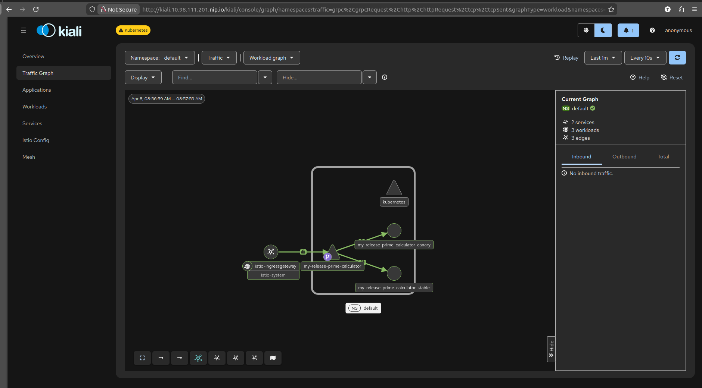

# Istio Service Mesh Playground

This project provides a comprehensive, hands-on environment for exploring and learning about the Istio service mesh. It includes a sample microservice application, a complete local Minikube setup, and a full suite of observability tools.

The primary goal of this repository is to serve as a practical learning tool for understanding advanced Istio concepts such as canary deployments, traffic management, and network security in a controlled, easy-to-manage setting.

## Features

-   **Canary Deployments:** The Helm chart is pre-configured to deploy `stable` and `canary` versions of the application, with a `VirtualService` that splits traffic 90/10 by default.
-   **Full Observability Stack:** Includes manifests to deploy and expose Prometheus and Kiali, giving you a complete view of your service mesh.
-   **Persistent Dashboards:** Kiali and Prometheus are exposed with stable URLs through the main Istio Ingress Gateway using `nip.io` for easy local access.
-   **Automated Local Setup:** A single script (`minikube/setup-local-env.sh`) completely automates the creation of the Minikube cluster, Istio installation, and deployment of the application and observability tools.
-   **Network Security:** Includes a `PeerAuthentication` policy to enforce strict mutual TLS (mTLS) for all traffic within the service mesh.
-   **Comprehensive Documentation:** Detailed setup instructions and explanations are provided for both automated and manual processes.

## Getting Started

To get started with the local development environment, please follow the detailed instructions in the **[Minikube Setup Guide](minikube/README.md)**.

This guide will walk you through setting up Minikube, installing Istio, and deploying the sample application and observability dashboards.

## License

This project is licensed under the Apache License 2.0. See the [LICENSE](LICENSE) file for details.

