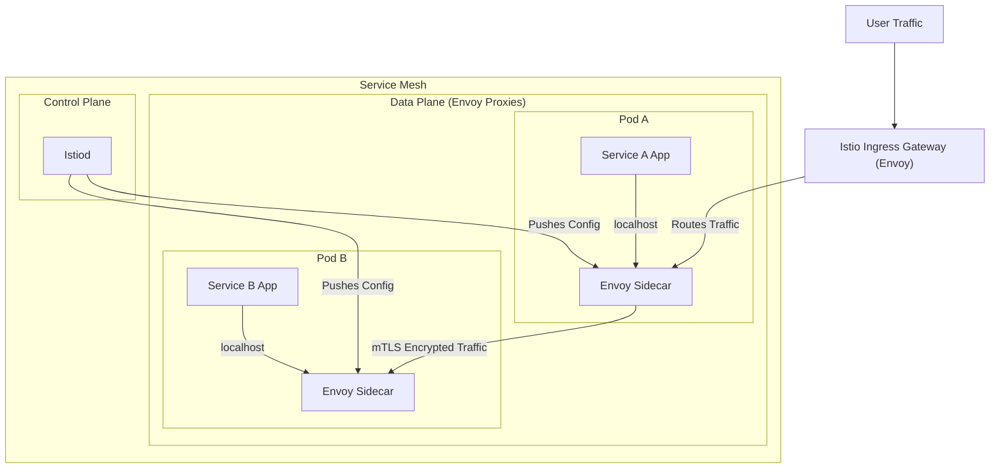

# Understanding Service Mesh and Istio

This document provides a beginner-friendly introduction to the concepts of a service mesh, Istio, and how we are using them in this project to manage and observe our services.
## What is a Service Mesh?

In a modern microservices architecture, an application is broken down into many small, independent services that communicate with each other over the network. A service mesh is a dedicated infrastructure layer that you add to your application. It allows you to transparently add capabilities like observability, traffic management, and security, without adding them to your own code.

Think of it as a networking layer for your services that provides a way to control and monitor how different parts of your application share data with one another.

Key features of a service mesh include:

-   **Traffic Management**: Control the flow of traffic between your services with features like load balancing, retries, and timeouts.
-   **Security**: Secure communication between services with mutual TLS (mTLS) encryption and authentication.
-   **Observability**: Get deep insights into your services with distributed tracing, metrics, and logging.

## What is Istio?

Istio is a popular open-source service mesh that layers transparently onto existing distributed applications. It provides a uniform way to secure, connect, and monitor services.

Istio works by deploying a special "sidecar" proxy alongside each of your service instances. This proxy, which is typically an Envoy proxy, intercepts all network communication between microservices. This allows Istio to enforce policies and collect telemetry data without any changes to your application code.
## Istio Architecture

Istio's architecture is logically split into two main components: the Data Plane and the Control Plane.



### The Data Plane

The data plane is composed of a set of intelligent proxies (Envoy) that are deployed as "sidecars" alongside your service containers in the same Kubernetes pod.

-   **What it does**: These proxies intercept and control all network communication between your microservices. They are the "muscle" of the service mesh, responsible for actually enforcing the rules.
-   **Key Functions**:
    -   **Traffic Control**: Dynamically control traffic routing, allowing for canary releases, A/B testing, and blue-green deployments.
    -   **Security**: Enforce security policies and automatically encrypt traffic between services using mutual TLS (mTLS).
    -   **Telemetry**: Collect a rich set of metrics, logs, and traces for all traffic, providing deep observability into your application's behavior.
-   **How it works**: Your application code doesn't know the sidecar exists. It simply sends traffic to what it thinks is another service (e.g., `http://service-b`). The Envoy sidecar intercepts this call and applies the routing, security, and telemetry rules before forwarding the traffic to the destination's Envoy sidecar.

### The Control Plane

The control plane is the "brain" of the service mesh. In modern versions of Istio, the control plane's functionality is consolidated into a single binary called `Istiod`.

-   **What it does**: `Istiod` manages and configures all the Envoy proxies in the data plane. It takes your high-level rules and translates them into specific configurations that the Envoy proxies can understand.
-   **Key Functions**:
    -   **Service Discovery**: It gets a list of all services and endpoints from the underlying platform (like Kubernetes) and provides it to the Envoy proxies.
    -   **Configuration**: It translates high-level routing rules from Istio's Custom Resource Definitions (CRDs) like `Gateway` and `VirtualService` into specific configurations for the Envoy proxies.
    -   **Certificate Management**: It acts as a Certificate Authority (CA) to issue and rotate the certificates that the Envoy proxies use for secure mTLS communication.

In summary, you, the operator, define the desired behavior of your service mesh using Istio's configuration resources (CRDs). `Istiod` (the control plane) listens for these configurations and translates them into instructions for the Envoy proxies (the data plane), which then execute those instructions on the network traffic.
## Alternatives to Istio

While Istio is a powerful and popular service mesh, there are other alternatives available, each with its own strengths:

-   **Linkerd**: Known for its simplicity and low resource footprint. It is a good choice for teams that are new to service meshes.
-   **Consul Connect**: Part of the HashiCorp ecosystem, Consul Connect provides service discovery and a service mesh in one package.
-   **Kuma**: A universal service mesh that can run on both Kubernetes and traditional VM-based environments.

## Visualizing the Service Mesh with Kiali

While using the terminal is great for managing Istio, a visual tool can provide a much clearer understanding of how your services are interacting within the mesh. Kiali is a powerful, open-source observability console for Istio that provides a web-based interface to visualize your service mesh.

With Kiali, you can:

-   See a graph of how your services are connected.
-   Visualize the flow of traffic in real-time.
-   Check the health of your services.
-   Analyze traces with Jaeger integration.

### Installing Kiali and other Addons

Istio comes with a set of sample addons that can be installed to enhance its functionality. These include:

-   **Prometheus**: For collecting metrics.
-   **Grafana**: For visualizing metrics with dashboards.
-   **Jaeger**: For distributed tracing.
-   **Kiali**: For service mesh visualization.

To install these addons, you need to run a command from within your Istio installation directory. This is the directory that was created when you downloaded and extracted Istio (e.g., `istio-1.17.2`).

**Important**: You must navigate into this directory first before running the command, otherwise you will see an error like `error: the path "samples/addons/" does not exist`.

```sh
# 1. Navigate to your Istio installation directory
# Example:
# cd istio-1.17.2

# 2. Apply the addons manifest
kubectl apply -f samples/addons/
```

This command applies the Kubernetes manifests located in the `samples/addons/` directory, which creates the deployments and services for Kiali, Prometheus, Grafana, and Jaeger in the `istio-system` namespace.
### Launching the Kiali Dashboard

Once the addons are installed and running, you can easily open the Kiali dashboard using `istioctl`:

```sh
istioctl dashboard kiali
```

This command will open the Kiali UI in your default web browser, providing you with a comprehensive, interactive view of your service mesh.
